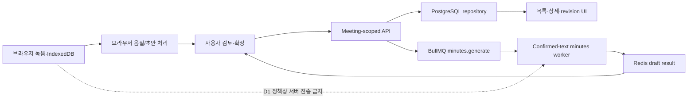

# 로컬 기능 버전 통합 분석

> 진행 상태: 단계 0~7 완료. 단계별 구현 및 검증 상세는 `docs/STAGE1_DOMAIN_PROVIDER_CONTRACTS.md`, `docs/STAGE2_POSTGRESQL_REPOSITORY.md`, `docs/STAGE3_MEETING_SCOPED_API.md`, `docs/STAGE4_BROWSER_RECORDING_QUALITY.md`, `docs/STAGE5_SPEAKER_DICTIONARY_REVIEW_UI.md`, `docs/STAGE6_QUEUE_WORKER_PROVIDER_DEPLOYMENT.md`, `docs/STAGE7_SECURITY_PRIVACY_OPERATIONS.md`를 참조한다.

작성일: 2026-07-16
통합 기준 프로젝트: `C:\Work\HJSolution\MeetingLoop-AI`
기능 소스 프로젝트: `C:\Work\HJSolution\MeetingLoop-AI-source-20260715`

## 1. 목적과 결론

목표는 로컬 버전에 추가된 단일 마이크 회의 분석 기능을 현재의 서버 실행 가능 버전에 옮기되, 현재 버전이 확보한 PostgreSQL 영속성, 조직 격리, 버전 충돌 방지, 배포 안전성을 유지하는 것이다.

결론은 다음과 같다.

1. 현재 프로젝트를 통합 기준으로 유지해야 한다. 로컬 프로젝트를 덮어쓰거나 디렉터리 단위로 복사하면 서버 기능과 보안 장치가 후퇴한다.
2. 로컬 버전의 핵심 추가 기능은 상당 부분 구현되어 있지만, 다수 기능이 `Demo` 메모리 저장소와 deterministic/mock provider에 연결되어 있다. 기능 프로토타입과 테스트 자산으로는 유용하지만 현재 상태 그대로는 서버 운영용 구현이 아니다.
3. 통합의 핵심 작업은 UI 복사가 아니라 로컬 기능의 도메인 계약을 현재 PostgreSQL 모델과 API에 다시 연결하는 것이다.
4. 원본 음성 및 파생 음성 저장 정책은 구현 전에 결정해야 한다. 현재 버전은 원본 음성 서버 업로드를 명시적으로 금지하지만 로컬 버전에는 서버 업로드, signed URL, Gemini 음성 전사 경로가 존재한다.
5. 통합은 도메인 계약 → DB migration/repository → meeting-scoped API → UI → worker/배포 순서로 진행해야 한다.

## 2. 분석 범위와 방법

- `.git`, `node_modules`, `.next`, `dist`, `test-results`, `.idea`, 로컬 비밀값 파일을 제외했다.
- 줄바꿈 차이를 정규화한 뒤 파일 내용을 비교했다.
- 기능 소스 폴더에는 `.git`이 없으므로 공통 조상이나 commit 단위 병합은 할 수 없다. 파일 및 동작 단위 포팅이 필요하다.
- 현재 프로젝트는 `codex/stage2-persistence-schema` 브랜치의 `9d34533` commit을 기준으로 확인했다.

정규화 비교 결과는 다음과 같다.

| 구분 | 파일 수 | 의미 |
|---|---:|---|
| 내용 동일 | 31 | 그대로 유지 가능 |
| 양쪽에 있으나 변경 | 37 | 수동 병합 필요 |
| 로컬 버전에만 존재 | 44 | 기능 포팅 후보 |
| 현재 서버 버전에만 존재 | 52 | 보존해야 할 서버 기능 |
| 합계 | 164 | 분석 대상 파일 합집합 |

## 3. 현재 기준선 검증 결과

`pnpm run ci` 실행 결과:

- lint 성공
- TypeScript project build 성공
- unit test 8개 파일, 27개 테스트 성공
- DB가 필요 없는 integration test 4개 성공
- PostgreSQL 연결이 필요한 integration test 38개는 `DATABASE_URL` 미설정으로 skip
- Next.js production build 성공

검증 한계:

- 이 분석 환경에서는 Docker Desktop engine이 실행 중이지 않아 PostgreSQL 통합 테스트, E2E, EC2 compose 기동을 재검증하지 못했다.
- 로컬 기능 소스는 별도 의존성 설치 없이 정적 분석했다. 해당 폴더의 진행 문서에는 lint/typecheck/test/build 통과 기록이 있으나 이번 분석에서 독립 재실행한 결과는 아니다.

## 4. 두 버전의 구조 비교

| 영역 | 현재 서버 버전 | 로컬 기능 버전 | 통합 판단 |
|---|---|---|---|
| 사용자/조직/프로젝트 | PostgreSQL repository | 프로세스 메모리의 `Demo` repository | 현재 구현 유지 |
| 세션 권한 | 토큰 검증 후 DB에서 membership/role 재검증 | 토큰 안의 role을 그대로 사용 | 현재 구현 유지 |
| 회의/전사/회의록 | PostgreSQL, 조직 범위, revision/version 관리 | 메모리 저장, client segment 중복 방지 중심 | 현재 모델에 로컬 필드 포팅 |
| 원본 음성 정책 | 브라우저 보관, 서버 업로드 API 없음 | 조건부 chunk upload, signed playback, Gemini 음성 전사 | 정책 결정 전 통합 금지 |
| 음질/VAD/겹침/화자 | 없음 | deterministic provider와 API/UI 구현 | 포팅 대상 |
| 빠른/정밀 STT | 최종 텍스트 기반 AI 회의록 | quick/precise run, 후보 선정, alignment | 포팅 대상, provider 성숙도 구분 필요 |
| 프로젝트 사전 | 없음 | CRUD/import/apply 및 수정 이력 | 포팅 대상 |
| 결정/할 일 검토 | 최종 회의록 구조만 존재 | evidence와 risk 기반 review queue | 포팅 대상 |
| Queue/worker | 인터페이스 placeholder | BullMQ와 worker processor 구현 | 배포 topology를 포함해 포팅 |
| DB migration | checksum, advisory lock, migrator container | 실행 스크립트 placeholder, 추가 SQL이 `infra/migrations`에 분리 | 현재 migration 체계로 재작성 |
| readiness | 실제 DB 연결을 검사하는 `/api/health/ready` | 설정 상태 중심 `/api/health` | 현재 구현 유지 및 worker readiness 추가 |
| EC2 노출 | `127.0.0.1:3101`, migration 선실행 | `0.0.0.0:3101`, web 단독 | 현재 구현 유지 |
| 회의 탐색 UI | 목록, 필터, 상세, 생성, revision | 루트의 단일 workbench 중심 | 현재 navigation 보존, workbench 확장 |

## 5. 로컬 버전에서 가져올 기능

### 5.1 녹음 및 브라우저 UX

- 5초 입력 테스트, 마이크 권한 상태, 입력 레벨, 저음량/clipping/무음/소음 안내
- 네트워크 단절 중 로컬 녹음 지속
- IndexedDB 임시 저장 및 모바일 AAC fallback
- 녹음 종료 후 음질 리포트

주요 자산:

- `apps/web/app/RecordingPanel.tsx`
- `tests/e2e/home.spec.ts`
- `tests/fixtures/audio-quality/*`

### 5.2 오디오 분석 파이프라인

- 음질 점수 및 정밀 분석 권고
- normalization artifact와 time mapping
- VAD voice region
- overlap region 및 HIGH 위험 자동 확정 차단
- diarization, speaker cluster, 병합/분할/지정
- quick/precise transcription run, 후보 선정, source separation, word alignment

주요 자산:

- `packages/domain/src/index.ts`
- `packages/ai/src/index.ts`
- `apps/web/app/api/audio/**`
- `apps/worker/src/index.ts`

주의: 이름 그대로 대부분 deterministic provider이며 fixture 기반 규칙 구현이다. 실제 FFmpeg 변환, 실제 VAD/OSD/diarization 모델, 실제 source separation을 완료한 것으로 간주하면 안 된다.

### 5.3 전사 및 검토 기능

- raw/normalized/edited 텍스트 층
- 낮은 confidence 및 overlap/speaker 위험 표시
- 프로젝트/조직 사전 CRUD, import, apply
- segment reprocess와 edit history
- speaker review panel
- extracted item, evidence link, 승인/반려/수정, review queue

주요 자산:

- `apps/web/app/api/projects/[projectId]/dictionary/**`
- `apps/web/app/api/meetings/[meetingId]/speakers/**`
- `apps/web/app/api/meetings/[meetingId]/review-queue/route.ts`
- `apps/web/app/api/items/**`
- `packages/db/src/review-loop.test.ts`
- `packages/domain/src/review-loop.test.ts`

### 5.4 테스트 및 명세 자산

- `CODEX_SINGLE_MIC_AUDIO_OPTIMIZATION_LOOP.md`
- audio quality fixture 7종
- AI/domain/db/queue/worker unit test
- recording, dictionary, speaker review, HIGH overlap decision E2E 시나리오

이 자산은 구현을 그대로 복사하기보다 현재 서버 모델용 acceptance test로 먼저 옮기는 편이 안전하다.

## 6. 현재 서버 버전에서 반드시 보존할 기능

- `packages/db/src/pool.ts`, `transaction.ts`의 실제 PostgreSQL 연결과 transaction
- `packages/db/migrations/0002`~`0005`의 confirmed-only 정책, revision, 검색 index, FK delete 정책, tenant 복합 FK
- `apps/web/app/session.ts`의 membership 및 최신 role 재검증
- meeting-scoped transcript/minutes API와 optimistic version conflict 처리
- `/api/health/ready`의 DB readiness
- `/meetings`, `/meetings/new`, `/meetings/[meetingId]`의 생성·목록·검색·상세·revision UI
- Docker migrator stage와 `migrate` service
- EC2 web port의 `127.0.0.1` 바인딩과 `host-gateway`
- 원본 음성 업로드 경로가 없음을 확인하는 data-policy integration test
- 안전한 서버 오류 메시지, request size guard

## 7. 주요 충돌 지점

### C1. DB repository 충돌 — 최우선

현재 `packages/db/src/index.ts`는 약 1,145줄의 PostgreSQL repository이고, 로컬 파일은 약 2,119줄의 메모리 `Demo` repository다. 로컬 API 대부분이 `saveDemo*`, `getDemo*`를 직접 호출한다.

해결 방향:

- 현재 repository를 유지한다.
- 로컬 도메인별로 PostgreSQL 함수와 작은 repository module을 추가한다.
- 공개 함수 이름에서 `Demo`를 제거하고 user/organization/meeting scope를 함수 인자로 강제한다.
- 모든 mutation은 현재의 role guard와 transaction 패턴을 사용한다.

### C2. Migration 위치와 품질 충돌 — 최우선

로컬 추가 SQL은 `infra/migrations/0002_single_mic_audio_quality.sql`에 있지만 현재 migrator는 `packages/db/migrations`만 읽는다. 로컬의 `packages/db/scripts/migrate.mjs`는 실제 migration을 수행하지 않는 placeholder다.

또한 로컬 SQL은 다수 테이블에 FK가 없고 현재의 tenant 복합 FK, cascade/restrict 정책을 반영하지 않는다. `transcript_segments`의 현재 구조도 로컬 SQL 작성 시점과 달라졌다.

해결 방향:

- 기존 migration 파일을 수정하지 않는다.
- 현재 migration 체계에 `0006` 이후 append-only migration으로 재작성한다.
- 모든 organization/meeting/project 참조에 FK 및 tenant 일관성 제약을 추가한다.
- migration up, 기존 데이터 호환, rollback이 아닌 forward-fix 시나리오를 테스트한다.

### C3. 원본 음성/파생 데이터 정책 충돌 — 구현 전 결정 필요

현재 버전은 원본 음성 서버 업로드 API가 없어야 한다는 테스트를 갖고 있다. 로컬 버전에는 다음 경로가 있다.

- `/api/recordings/chunks`
- `/api/recordings/playback-url`
- `/api/recordings/analyze-file`
- `ALLOW_RAW_AUDIO_SERVER_UPLOAD`
- S3/MinIO storage key를 갖는 audio artifact

권장 기본안:

- 원본 음성은 브라우저/사용자 기기에만 둔다.
- 서버에는 사용자 동의가 확인된 최종 전사·회의록과 필요한 비음성 파생 메타데이터만 저장한다.
- 원본 또는 분리 음원 업로드가 필요한 기능은 별도 보안/보존 정책 승인 후 feature flag가 아니라 명시적 제품 모드로 도입한다.

### C4. Transcript 모델 충돌

현재 DB는 `raw_text`를 제거하고 confirmed transcript와 revision만 저장한다. 로컬 검토 기능은 raw/normalized/edited를 분리해 저장한다.

가능한 선택지는 두 가지다.

1. 브라우저 초안 모델: raw/normalized는 IndexedDB에 두고 사용자가 확정한 edited text만 서버에 저장한다.
2. 서버 검토 모델: raw/normalized도 서버에 저장하되 데이터 정책, 보존 기간, 삭제, 접근 권한을 새로 정의한다.

현재 정책과의 일관성을 위해 1안을 우선 권장한다. 다만 서버 기반 review queue와 worker 재처리를 완전하게 사용하려면 2안 또는 제한된 파생 데이터 저장 정책이 필요하다.

### C5. API 계약 충돌

현재는 `/api/meetings/[meetingId]/transcript`와 `/minutes`가 version 기반이다. 로컬은 `/api/transcripts/segments`, `/api/minutes/generate`, `/api/minutes/finalize`의 demo 계약에 의존한다.

해결 방향:

- 모든 신규 API를 meeting-scoped로 통일한다.
- mutation에 expected/base version 또는 idempotency key를 포함한다.
- 현재 API 오류 코드와 request size guard를 재사용한다.

### C6. 세션과 권한 충돌

로컬 `session.ts`는 서명된 토큰의 role을 그대로 신뢰한다. 이 방식은 관리자가 membership을 비활성화하거나 role을 바꾼 뒤에도 기존 권한이 남을 수 있다.

해결 방향: 현재의 DB 재검증을 유지하고 모든 신규 API에서 organization scope와 mutation role을 다시 확인한다.

### C7. UI 병합 충돌

양쪽 `RecordingPanel.tsx`가 같은 파일에서 크게 갈라졌다. 현재 파일은 약 1,314줄이며 versioned persistence/error UX를 포함하고, 로컬 파일은 약 3,443줄이며 음질·화자·사전·검토 기능을 포함한다.

해결 방향:

- 어느 한쪽 파일로 교체하지 않는다.
- recording, quality, transcript editor, speaker review, dictionary, review queue를 component/hook으로 분리한다.
- 현재 meeting ID, revision/version, conflict recovery를 상위 orchestration으로 유지한다.

### C8. Worker와 배포 충돌

로컬 worker와 BullMQ는 구현되었지만 EC2 compose와 Dockerfile은 worker image/service를 실행하지 않는다. 현재 EC2 compose도 web/migrator만 실행한다.

해결 방향:

- lightweight 요청 처리와 background job의 경계를 먼저 정한다.
- worker target/service, Redis 연결, readiness, retry, idempotency, graceful shutdown을 함께 배포한다.
- worker가 여전히 `Demo` repository를 호출하는 부분을 PostgreSQL repository로 교체한다.

### C9. Package dependency와 Docker context 충돌

- 로컬 web API는 `@meetingloop/storage`를 import하지만 `apps/web/package.json`에 직접 dependency가 없다.
- 로컬 worker는 `@meetingloop/domain`을 직접 import하지만 직접 dependency가 없다.
- Docker dependency stage 및 builder copy 목록은 queue/worker 배포를 포함하지 않는다.

해결 방향: 직접 import하는 workspace package를 각 package manifest에 선언하고 Docker의 manifest/copy/build target을 함께 갱신한다.

### C10. 운영 상태 확인과 네트워크 충돌

로컬 compose는 migration 선실행이 없고 web port를 외부 전체에 공개한다. `/api/health`도 실제 PostgreSQL readiness를 보장하지 않는다.

해결 방향: 현재 migrator, `/api/health/ready`, localhost bind를 유지하고 worker/Redis readiness만 추가한다.

### C11. 테스트 전용 API

로컬의 `/api/test/reset`은 `E2E_MODE`로 보호되지만 route 자체가 production build에 포함된다. 운영 artifact에서는 제외하거나 production에서 항상 404가 되도록 보장해야 한다.

### C12. 기능 완성도 오해 위험

로컬 진행표에서 다음 항목은 미완료로 남아 있다.

- chunk upload resume
- 실제 FFmpeg 표준 변환
- echo/reverberation 및 dereverberation
- HIGH overlap 반복 재생/완전한 검토 흐름 일부
- 녹음 동의, 조직 격리, 프로젝트 권한, 삭제/보존, 민감 로그 등 보안 단계
- fixture 확장, provider 실패, 네트워크 실패, 운영 지표, Docker 배포 검증

따라서 로컬 버전의 완료 체크를 운영 준비 완료로 해석하면 안 된다.

## 8. 권장 목표 구조

원칙:

- 브라우저가 원본 음성 소유권을 가진다.
- 서버 mutation은 meeting, organization, actor, version/idempotency를 항상 가진다.
- web과 worker 모두 동일한 PostgreSQL repository와 domain validation을 사용한다.
- deterministic provider와 real provider의 상태를 UI/health에서 명확히 구분한다.
- migration은 현재 checksum 체계에 append-only로 추가한다.

## 9. 파일 단위 통합 분류

### 그대로 보존할 현재 서버 파일군

- `packages/db/src/pool.ts`, `transaction.ts`
- `packages/db/migrations/0002_*`~`0005_*`
- `apps/web/app/api/health/ready/route.ts`
- `apps/web/app/api/meetings/[meetingId]/transcript/**`
- `apps/web/app/api/meetings/[meetingId]/minutes/**`
- `apps/web/app/meetings/**`
- `apps/web/app/api-errors.ts`, `server-error.ts`, `transcript-api.ts`
- `docs/DATA_STORAGE_POLICY.md`
- 현재 EC2 `Dockerfile`, `compose.ec2.yml`의 migrator/network 원칙

### 로컬에서 포팅할 파일군

- `apps/web/app/api/audio/**`
- `apps/web/app/api/projects/[projectId]/dictionary/**`
- `apps/web/app/api/meetings/[meetingId]/speakers/**`
- `apps/web/app/api/meetings/[meetingId]/review*`
- `apps/web/app/api/items/**`
- `packages/domain/src/review-loop.test.ts`
- `packages/db/src/review-loop.test.ts`
- `tests/fixtures/audio-quality/**`
- `packages/queue/src/index.test.ts`
- 추가된 worker/AI/domain tests

### 수동 병합할 핵심 파일

- `packages/domain/src/index.ts`
- `packages/ai/src/index.ts`
- `packages/db/src/index.ts`
- `apps/web/app/RecordingPanel.tsx`
- `apps/web/app/globals.css`
- `apps/web/app/actions.ts`, `session.ts`, `page.tsx`
- `apps/worker/src/index.ts`
- `packages/queue/src/index.ts`
- root/package manifests, Dockerfile, compose, env examples, README

### 정책 결정 전 제외할 로컬 경로

- `apps/web/app/api/recordings/chunks/route.ts`
- `apps/web/app/api/recordings/playback-url/route.ts`
- `apps/web/app/api/recordings/analyze-file/route.ts`
- `ALLOW_RAW_AUDIO_SERVER_UPLOAD`
- 원본/분리 음원을 서버 storage에 저장하는 schema와 UI

## 10. 위험도 요약

| 위험 | 수준 | 영향 | 대응 |
|---|---|---|---|
| Demo repository가 운영 코드로 유입 | 매우 높음 | 재시작 시 데이터 손실 | PostgreSQL adapter 완료 전 API 연결 금지 |
| 기존 migration 수정 또는 번호 충돌 | 매우 높음 | 배포 DB migration 실패 | `0006` 이후 append-only |
| raw audio 정책의 묵시적 변경 | 매우 높음 | 개인정보/보존 정책 위반 | 결정 게이트와 data-policy test 유지 |
| tenant FK/필터 누락 | 매우 높음 | 조직 간 데이터 노출 | 복합 FK, scope query, negative integration test |
| transcript version 제거 | 높음 | 동시 편집 덮어쓰기 | expected version과 revision 유지 |
| worker 미배포 | 높음 | 로컬에서는 되고 서버에서는 미동작 | Docker/compose/readiness까지 한 작업 단위로 완료 |
| deterministic 결과를 실제 AI로 표시 | 높음 | 품질 오해 | provider capability와 상태 표시 |
| 3,443줄 UI의 일괄 병합 | 높음 | 회귀 및 유지보수 악화 | vertical slice 및 component 분리 |

## 11. 통합 시작 전 결정 사항

| ID | 결정 | 권장안 | 결정되지 않을 때 영향 |
|---|---|---|---|
| D1 | 원본 음성 서버 업로드 허용 여부 | 기본 금지 | analyze-file/chunk/playback 기능 보류 |
| D2 | raw/normalized 전사 서버 저장 여부 | 브라우저 초안, confirmed만 서버 저장 | server-side 재처리/검토 기능 범위 축소 |
| D3 | 파생 비음성 메타데이터 저장 범위 | 동의·보존 기간을 명시하고 PostgreSQL 저장 | 품질/화자/review 상태가 재시작 후 유지되지 않음 |
| D4 | background worker 운영 여부 | 무거운 분석은 worker | web timeout 및 확장성 저하 |
| D5 | 1차 제공 provider | deterministic은 데모 표시, 실제 provider는 별도 | 기능 품질 오인 위험 |

세부 실행 순서와 완료 조건은 `docs/LOCAL_VERSION_INTEGRATION_WORKLIST.md`에 정리한다.
