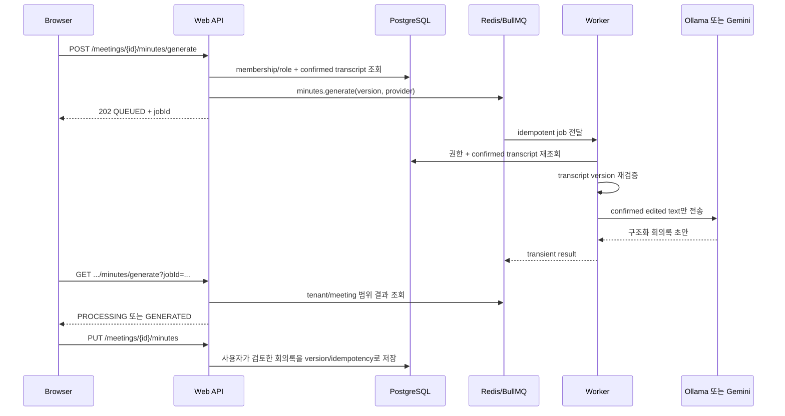

# 단계 6 Queue, worker, 실제 provider 및 배포

작성일: 2026-07-16
상태: 완료
선행 결정: `docs/STAGE0_POLICY_AND_BASELINE.md`의 D1~D5

## 1. 결과

서버 운영 경로에 Redis/BullMQ worker를 추가했다. worker는 사용자가 확정한 전사 텍스트로 회의록 초안을 생성하는 `minutes.generate`만 처리한다. 원본 음성, 음질 frame, VAD/overlap, 미확정 화자, raw/normalized 전사, review 초안은 Queue payload와 worker 경로에 들어가지 않는다.

개발·CI 기본값은 `inline`이며 기존 사용자 흐름과 E2E를 유지한다. EC2 compose는 `ANALYSIS_QUEUE_MODE=redis`로 web 요청과 실제 분석 실행을 분리한다.

## 2. 선행 단계 인계 반영

| 인계 | 단계 6 반영 |
|---|---|
| D1 원본 음성 서버 전송 금지 | audio upload, FFmpeg, VAD/OSD, diarization, STT job을 만들지 않았다. |
| D2 confirmed transcript만 서버 저장 | enqueue와 worker 실행 시 PostgreSQL의 confirmed transcript를 다시 읽는다. |
| D3 검토 파생정보 browser-only | Queue payload에 review draft/evidence/speaker candidate를 넣지 않았다. |
| D4 text-only worker | `minutes.generate` 하나만 허용하고 browser-only 작업을 명시적으로 거부한다. |
| D5 demo/real 구분 | mock은 개발·CI 전용이고 production에서는 거부한다. Ollama/Gemini는 real provider로 표시한다. |
| 단계 2 schema | web readiness와 worker startup 모두 migration `0006_single_mic_processing_schema.sql`을 확인한다. |
| 단계 3 meeting scope | enqueue와 polling은 session, organization, meeting, editor role을 재검증한다. |
| 단계 4~5 browser draft | 녹음·화자·사전·검토 초안은 기존 IndexedDB 경계를 유지한다. |
| BASE-E2E-002 | 실제 오류 panel로 Playwright locator를 제한해 모바일 strict-mode 충돌을 해소했다. |

## 3. 실행 구조



provider 성공만으로 PostgreSQL의 confirmed 회의록을 변경하지 않는다. 사용자가 초안을 검토하고 기존 meeting-scoped PUT을 실행해야 revision이 생성된다.

## 4. Queue 계약과 실패 의미

- Queue: `meetingloop-processing`
- 허용 job: `minutes.generate`
- idempotency 원문: `{meetingId}:minutes.generate:v{transcriptVersion}:{provider}`
- BullMQ job ID: 원문을 안전한 문자로 정규화한 최대 160자 값
- payload: `organizationId`, `meetingId`, `requestedBy`, `transcriptVersion`, `provider`
- retry: 최대 3회, 2초부터 exponential backoff
- worker concurrency: 기본 2, 허용 범위 1~16
- timeout: 기본 240초
- stalled job: 1회 복구 후 실패 처리
- 보존: 성공 결과 1시간/최대 1,000개, 실패 7일/최대 5,000개

worker는 실행 직전에 membership/role, organization/meeting scope, confirmed transcript version을 재검증한다. 대기 중 전사가 수정되면 `TRANSCRIPT_VERSION_CHANGED`로 실패하며 오래된 텍스트로 초안을 생성하지 않는다. 실패 로그에는 job ID, job type, 재시도/종료 상태, 안전한 오류 코드만 기록하고 전사 내용이나 API key는 기록하지 않는다.

## 5. 실제 provider 범위

| provider | 모드 | 입력 | 외부 전송 | 운영 조건 |
|---|---|---|---|---|
| Ollama | real | confirmed edited transcript | 없음 | worker에서 접근 가능한 `OLLAMA_HOST`와 설치 모델 필요 |
| Gemini | real | confirmed edited transcript | Google API로 텍스트 전송 | 유효한 `GEMINI_API_KEY`와 조직의 외부 전송 동의 필요 |
| deterministic mock | demo | fixture/confirmed test text | 없음 | 개발·CI만 허용, production 거부 |

상태 API는 provider별 model, available, mode, externalTransmission, estimatedCost, expectedLatency, qualityProfile을 반환한다. UI도 현재 Queue mode, lag, failed count와 provider 비용·속도·품질 정보를 표시한다.

실제 Ollama/Gemini adapter와 오류 계약은 자동 테스트했다. 이번 검증에서는 운영 API key로 Gemini에 live 요청하거나 특정 Ollama 모델의 품질을 평가하지 않았으므로, provider별 실데이터 품질·비용 인수는 배포 환경에서 별도로 수행해야 한다.

## 6. 배포 순서

1. web, worker, migrator image를 동일 source revision으로 build한다.
2. PostgreSQL backup을 확인한다.
3. `migrate` one-shot container를 실행하고 성공을 확인한다.
4. Redis를 기동하고 `PING` healthcheck와 AOF volume을 확인한다.
5. worker를 기동한다. worker는 required schema가 없으면 시작하지 않는다.
6. web을 기동한다. web readiness는 DB와 required schema를 확인한다.
7. `/api/health/ready`, worker `/health/ready`, `/api/ai/status`를 확인한다.
8. Nginx HTTPS upstream은 계속 `127.0.0.1:3101`을 사용한다. Redis와 worker health port는 외부에 publish하지 않는다.

권장 명령:

```powershell
Copy-Item .env.docker.example .env.docker
docker compose -f compose.ec2.yml --env-file .env.docker config
docker compose -f compose.ec2.yml --env-file .env.docker build
docker compose -f compose.ec2.yml --env-file .env.docker up -d
docker compose -f compose.ec2.yml ps
```

web readiness는 worker 장애에 종속되지 않는다. 따라서 worker 또는 Redis가 일시 장애여도 회의 조회·확정 전사·확정 회의록 기능은 유지되고, 분석 기능의 장애는 `/api/ai/status`와 분석 UI에 별도로 표시된다.

## 7. 환경 변수

| key | 기본/용도 |
|---|---|
| `ANALYSIS_QUEUE_MODE` | `inline` 또는 `redis`; compose는 `redis` |
| `REDIS_URL` | BullMQ 연결 URL |
| `WORKER_CONCURRENCY` | 기본 2 |
| `WORKER_JOB_TIMEOUT_MS` | 기본 240000 |
| `WORKER_HEALTH_PORT` | 기본 3001 |
| `ANALYSIS_PROVIDER` | production은 `ollama` 또는 `gemini` |
| `OLLAMA_HOST`, `OLLAMA_MODEL` | 로컬 실제 provider |
| `GEMINI_API_KEY`, `GEMINI_MODEL` | 외부 실제 provider |

## 8. 검증 결과

| 검증 | 결과 |
|---|---|
| lint/typecheck/unit/build 전체 CI | 성공; unit 20 files, 69 tests |
| PostgreSQL integration | 11 files, 56 tests, skip 0 |
| Redis 7.4 실제 integration | 중복 제출과 worker 재시작 후 재제출이 동일 job ID와 실행 1회로 수렴 |
| Playwright mobile/desktop | 39/39 성공 |
| Next production build | 성공 |
| worker Docker image | `worker-runner` build 성공, non-root 실행 |
| worker container smoke | 실제 Redis/PostgreSQL 연결, `/health/ready` HTTP 200 |
| compose config | 성공, web `127.0.0.1:3101`, Redis/worker 비공개 |

Redis 통합 테스트는 별도 Redis를 준비한 뒤 실행한다.

```powershell
$env:REDIS_TEST_URL='redis://127.0.0.1:6379/15'
pnpm test:redis
```

## 9. 다음 단계 인계

- 단계 7에서 Gemini confirmed transcript 외부 전송 동의 문구와 감사 근거를 제품 흐름에 추가한다.
- 실패 job 7일 보존과 Redis AOF backup/restore, queue 정리 기준을 운영 정책에 포함한다.
- worker/provider/Redis 장애 시나리오와 alert threshold를 운영 모니터링에 연결한다.
- Queue의 생성 결과는 transient이므로 브라우저를 닫은 뒤 같은 job을 재연결하는 UX는 아직 없다.
- 원본 음성 기반 FFmpeg/VAD/OSD/diarization/STT는 D1~D3가 개정되기 전까지 서버 범위에 추가하지 않는다.
- 단계 8에서 실제 운영 DB 복제본 migration dry-run과 Nginx HTTPS 경유 수동 인수를 수행한다.
